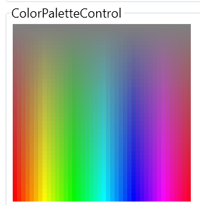

# ColorPaletteControl

A versatile and customizable color picker control for WPF .NET 6.0 applications. This user control allows users to select a color from a full color spectrum with varying saturation levels, automatically setting the chosen color's hexadecimal value to the clipboard for convenient use and updating the `SelectedColor` property.



## Features

- Comprehensive color palette using HSL color model
- Customizable color block size
- Automatic copying of selected color's hexadecimal value to clipboard
- Dynamic layout that wraps to fit various container shapes and sizes
- Intuitive selection experience for users
- Dependency properties for `SelectedColor`, `BlockWidth`, and `BlockHeight`

## Installation

### Option 1: NuGet Package

Install the `ColorPaletteControl` NuGet package:

```sh
Install-Package ColorPaletteControl -Version 1.0.0
```

### Option 2: Manual Installation

1. Clone or download the repository:

```sh
git clone https://github.com/yourusername/ColorPaletteControl.git
```

2. Add the `ColorPaletteControl.csproj` project to your WPF .NET 6.0 solution in Visual Studio.
3. Add a reference to the `ColorPaletteControl` project in the project where you want to use the control.

## Usage

1. In your XAML file, add a reference to the `ColorPaletteControl` namespace:

```xml
xmlns:cp="clr-namespace:ColorPaletteControl;assembly=ColorPaletteControl"
```

2. Add the `ColorPaletteControl` to your XAML:

```xml
<cp:ColorPaletteControl x:Name="ColorPicker" />
```

3. Adjust the `Width` and `Height` properties to change the dimensions of the control:

```xml
<cp:ColorPaletteControl x:Name="ColorPicker" Width="256" Height="256" />
```

4. The selected color's hexadecimal value will be automatically copied to the clipboard upon selection.

5. Bind the `SelectedColor`, `BlockWidth`, and `BlockHeight` properties to your view model or other controls:

```xml
<cp:ColorPaletteControl x:Name="ColorPicker" Width="256" Height="256" BlockWidth="20" BlockHeight="20" SelectedColor="{Binding MySelectedColor}" />
```

## Customization

You can customize the size of the color blocks by modifying the `BlockWidth` and `BlockHeight` dependency properties in XAML:

```xml
<cp:ColorPaletteControl x:Name="ColorPicker" Width="256" Height="256" BlockWidth="20" BlockHeight="20" />
```

## Contributing

We welcome contributions! Please feel free to submit pull requests for bug fixes, improvements, or new features.

1. Fork the repository
2. Create a new branch for your changes (`git checkout -b feature/my-feature`)
3. Commit your changes (`git commit -am "Add a new feature"`)
4. Push to the branch (`git push origin feature/my-feature`)
5. Create a new pull request

## License

ColorPaletteControl is licensed under the MIT License. Please see the [LICENSE](./LICENSE) file for more information.