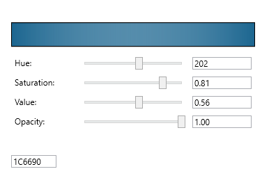

# ColorPicker Control

A custom user control for selecting and manipulating colors in a visually intuitive way.

## Table of Contents

- [Overview](#overview)
- [Features](#features)
- [Installation](#installation)
- [Usage](#usage)
- [API](#api)
- [Testing](#testing)
- [Documentation](#documentation)
- [Contributing](#contributing)
- [License](#license)

## Overview

ColorPicker Control is a powerful and easy-to-use custom control for selecting and manipulating colors. It provides a visual interface for choosing colors and allows the user to manipulate the selected color through various means, such as sliders, color palettes, and color pickers.

The control is built using the Model-View-ViewModel (MVVM) architectural pattern and is designed to be compatible with a wide range of applications.

## Features

- Modern, sleek appearance that fits well with the overall design of the application.
- Compact and unobtrusive, while still providing all necessary functionality.
- Color palette for selecting colors.
- Color sliders for adjusting Hue, Saturation, and Value.
- Opacity slider for adjusting the opacity of the selected color.
- Text box for entering hex code values.
- Preview area for displaying the selected color.

## Installation

To install the ColorPicker Control, follow these steps:

1. Download the latest release from the [GitHub repository](https://github.com/YourRepo/ColorPickerControl/releases).
2. Extract the contents of the release package.
3. Add a reference to the ColorPicker Control assembly in your project.
4. Add the necessary XAML namespace declarations in your application.

## Usage

To use the ColorPicker Control in your application, follow these steps:

1. Add the ColorPicker Control to your application's XAML file.
2. Bind the `SelectedColor` and `Opacity` properties to the appropriate properties in your ViewModel.
3. Subscribe to the `ColorChanged` event to receive notifications when the selected color changes.

## API

The ColorPicker Control exposes the following properties and events:

- `SelectedColor`: Gets or sets the currently selected color.
- `Opacity`: Gets or sets the opacity of the selected color.
- `ColorChanged`: An event that is raised when the selected color changes.

For more detailed API documentation, refer to the [API Documentation](./docs/api.md).

## Testing

The ColorPicker Control is thoroughly tested to ensure that it meets all functional and non-functional requirements. The following types of tests are performed:

- Unit tests: Test the individual components of the control in isolation.
- Integration tests: Test the interaction between the components of the control.
- User acceptance tests: Test the control's functionality from a user's perspective.

## Documentation

The ColorPicker Control is well-documented to facilitate ease of use and extensibility. The following types of documentation are provided:

- [API documentation](./docs/api.md): Describes the properties and events exposed by the control.
- [Code documentation](./docs/code.md): Describes the implementation of the control's components.
- [User documentation](./docs/user.md): Describes how to use the control from a user's perspective.

## Contributing

We welcome contributions from the community. If you're interested in contributing to the ColorPicker Control, please read our [Contributing Guidelines](./CONTRIBUTING.md) for more information.

## License

The ColorPicker Control is licensed under the [MIT License](./LICENSE).

## Credits

ColorPicker  was developed by [Jon M. Sales](mailto:jonsales@jonmsales.com) as an open-source project. Special thanks to all contributors and users of the control.

---

Happy coding!