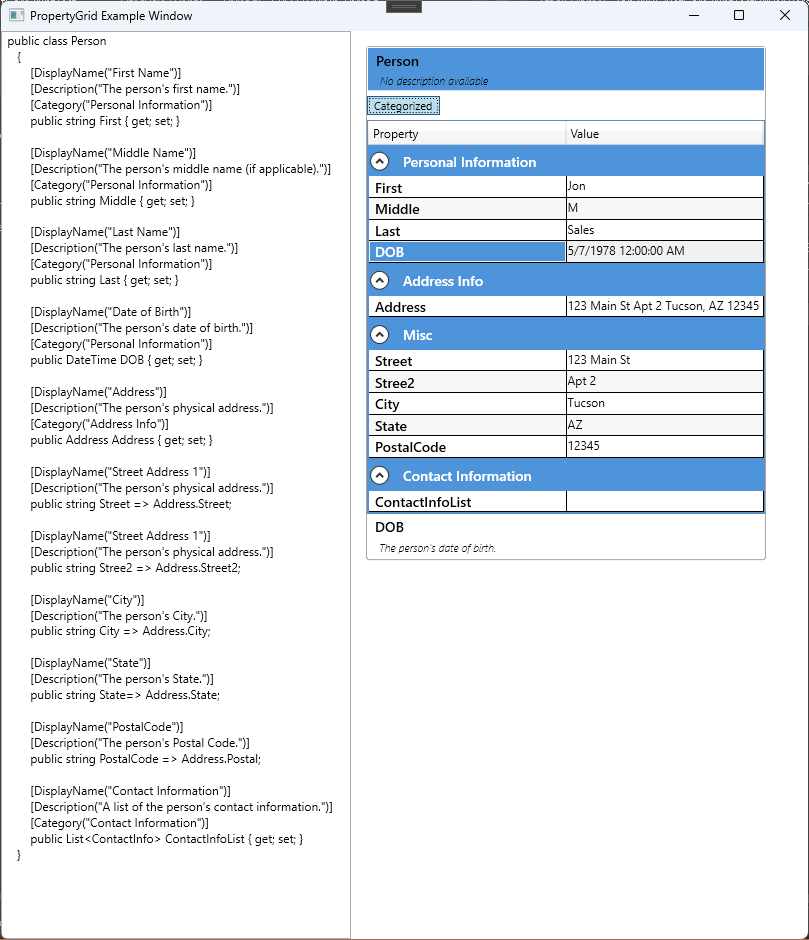
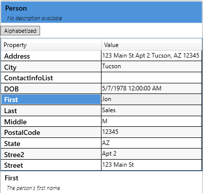

# PropertyGrid User Control

The PropertyGrid user control is a custom control for displaying and editing object properties in a user-friendly way. It is built using C#, WPF, and .NET Core v6.0, and provides auto-generation features, customizable editors, and support for property decorators.







## Features

- Auto-generation of property editors based on object properties
- Customizable editors for specific property types
- Support for custom property decorators
- Ability to group properties into categories
- Optional read-only mode for displaying property values without allowing edits

## Getting Started

### Prerequisites

- Visual Studio 2019 or later
- .NET Core v6.0 SDK or later

### Installing

1. Clone the repository: `git clone https://github.com/yourusername/PropertyGrid`
2. Open the solution in Visual Studio
3. Build the solution to restore NuGet packages and compile the code

### Usage

1. Add a reference to the PropertyGrid control in your project
2. Add the control to a WPF window or user control
3. Set the `SelectedObject` property of the control to the object whose properties you want to display and edit

```xml
<Window x:Class="MyApp.MainWindow"
        xmlns:pg="clr-namespace:PropertyGrid.Controls;assembly=PropertyGrid">
    <pg:PropertyGrid SelectedObject="{Binding MyObject}" />
</Window>
```

## Auto-generation of Property Editors

The control automatically generates editors for object properties. The following types of properties are supported:

- Boolean
- Byte
- Char
- DateTime
- Decimal
- Double
- Enum
- Guid
- Int16
- Int32
- Int64
- SByte
- Single
- String
- TimeSpan
- UInt16
- UInt32
- UInt64

## Customizable Editors

The control allows custom editors to be specified for specific property types. These editors can provide a customized user interface for editing the property value. To create a custom editor, implement the `ITypeEditor` interface and specify it using the `EditorAttribute` on the property.

```csharp
public class MyCustomEditor : ITypeEditor
{
    public FrameworkElement CreateElement(PropertyItem propertyItem)
    {
        // Create and return a custom editor element for the property
    }

    public void DestroyElement(PropertyItem propertyItem)
    {
        // Clean up the custom editor element when it is no longer needed
    }

    public void SetValue(PropertyItem propertyItem, object value)
    {
        // Update the property value with the new value
    }
}

public class MyObject
{
    [Editor(typeof(MyCustomEditor), typeof(MyCustomEditor))]
    public string MyProperty { get; set; }
}
```

## Support for Property Decorators

The control fully supports property decorators. These decorators can provide additional metadata and behavior for properties, such as validation rules, display names, and categories. To use a property decorator, implement the `IPropertyDecorator` interface and apply it to the property using the `DecoratorAttribute`.

```csharp
public class MyCustomDecorator : IPropertyDecorator
{
    public string Category { get; set; }

    public string DisplayName { get; set; }

    public bool IsReadOnly { get; set; }

    public bool IsRequired { get; set; }

    public object DefaultValue { get; set; }
}

public class MyObject
{
    [Decorator(Category = "My Category", DisplayName = "My Property", IsReadOnly = true)]
    public string MyProperty { get; set; }
}
```

## Grouping Properties into Categories

The control allows properties to be grouped into categories. These categories are collapsible and expandable and are displayed in a tree-like structure. To group properties into categories, apply the `CategoryAttribute` to the property.

```csharp
public class MyObject
{
    [Category("My Category")]
    public string MyProperty1 { get; set; }

    [Category("My Category")]
    public string MyProperty2 { get; set; }

    [Category("Other Category")]
    public string MyProperty3 { get; set; }
}
```

## Read-only Mode

The control provides an optional read-only mode, which allows properties to be displayed without allowing edits. To enable read-only mode, set the `IsReadOnly` property of the control to `true`.

```xml
<pg:PropertyGrid SelectedObject="{Binding MyObject}" IsReadOnly="True" />
```

## Contributing

Contributions are welcome! Please submit pull requests or issues on the [GitHub repository](https://github.com/yourusername/PropertyGrid).

## License

This project is licensed under the MIT License - see the [LICENSE.md](LICENSE.md) file for details.