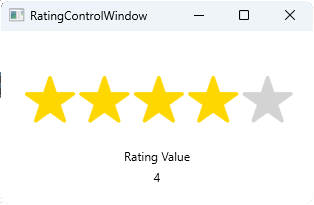

# RatingControl - WPF User Control

`RatingControl` is a versatile WPF user control that enables users to rate items on a scale of 1 to 5 stars.



## Features

- Clickable five-star rating system
- Complete Scalable. Scales to fit
- Read-only and editable mode options
- Half-star rating support for increased precision
- `RatingValue` property for binding to a ViewModel

## Usage

To incorporate the `RatingControl` into your application, add it to your XAML code:

```xml
<Window x:Class="MyApp.MainWindow"
        xmlns:uc="clr-namespace:Jon.WPF.NetCore.UserControls.MostWanted.Controls;assembly=Jon.WPF.NetCore.UserControls.MostWanted"
        ...>
    <Grid>
        <uc:RatingControl RatingValue="{Binding MyRating}" />
    </Grid>
</Window>
```

In this example, `MyRating` represents a property within your ViewModel that can be bound to the `RatingValue` property of the control.

## Customization

Enhance the appearance of the `RatingControl` by adjusting these resources:

- `RatingStarStyle`: Define the style of the star shape
- `RatingThumbStyle`: Customize the style of the thumb (white circle indicating the selected rating)
- `RatingSelectedBackgroundBrush`: Set the background color of selected stars
- `RatingDisabledBackgroundBrush`: Choose the background color for disabled stars
- `RatingDisabledBorderBrush`: Specify the border color of disabled stars

For a highly customizable and user-friendly rating experience, `RatingControl` offers a powerful solution for any WPF application.

## Contributing

If you'd like to contribute to the development of the ToggleSwitch Control, please follow these guidelines:

1. Fork the repository on GitHub.
2. Create a branch for your changes.
3. Make your changes and commit them to your branch.
4. Create a pull request with a description of your changes.

All contributions are greatly appreciated!

## Support

If you encounter any issues or have questions about the RatingControl , please create an issue on the GitHub repository, and we will do our best to help you.

## Credits

ToggleSwitch Control was developed by [Jon M. Sales](mailto:jonsales@jonmsales.com) as an open-source project. Special thanks to all contributors and users of the control.

---

Happy coding!