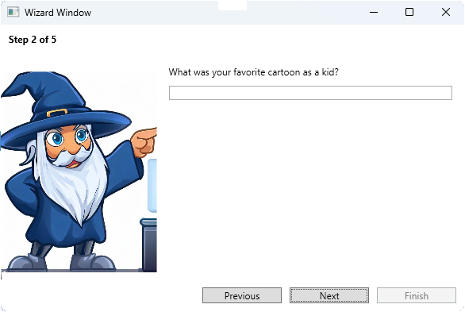

# Wizard Control

This project provides a customizable and easy-to-use WPF wizard control for creating step-by-step user interactions in your WPF applications. It comes with a set of pre-built views to handle common scenarios like gathering values, displaying confirmation screens, and performing actions with progress reporting.


## Table of Contents

- [Installation](#installation)
- [Usage](#usage)
- [Built-in Views](#built-in-views)
  - [WizardWindowWelcomeView](#wizardwindowwelcomeview)
  - [GatherValuesView](#gathervaluesview)
  - [PerformActionView](#performactionview)
  - [PerformActionConditionalView](#performactionconditionalview)
  - [ConfirmationView](#confirmationview)
- [Custom Views](#custom-views)
- [Contributing](#contributing)
- [License](#license)

## Installation

_TODO: Provide instructions for installing the library/package if applicable._

## Usage

To create a new wizard, follow these steps:

1. Create a new instance of the `WizardWindow` class.
2. Create instances of the built-in views or your custom views inheriting from `StepBase`.
3. Add the instances to the list of steps in the `WizardWindow`.
4. Call the `ShowDialog()` method on the `WizardWindow` instance to display the wizard.

Here's an example:

```csharp
var wizard = new WizardWindow(new List<StepBase>
{
    new WizardWindowWelcomeView("Welcome to the Most Wanted WPF Wizard!"),
    // ... Add more steps here ...
});

wizard.ShowDialog();
```

## Built-in Views

### WizardWindowWelcomeView

This view is typically used as the first screen of the wizard. It displays a nicely formatted text to welcome users.


_TODO: Provide a code example of using WizardWindowWelcomeView._

### GatherValuesView

This view provides a dynamic form for gathering values from the user.



_TODO: Provide a code example of using GatherValuesView._

### SelectOptionView

This view provides a dynamic form for gathering values from the user.


_TODO: Provide a code example of using GatherValuesView._

### PerformActionView

This view allows you to perform an action with progress reporting. The progress bar and status message are updated in real-time as the operation progresses.


_TODO: Provide a code example of using PerformActionView._

### PerformActionConditionalView

This view extends the `PerformActionView` to include conditional logic for determining the next step based on the result of the action.


_TODO: Provide a code example of using PerformActionConditionalView._

### ConfirmationView

This view can be used as the last screen of the wizard to display a summary of the selected options before final confirmation.


_TODO: Provide a code example of using ConfirmationView._

## Custom Views

_TODO: Explain how users can create custom views by inheriting from StepBase._

## Contributing

Pull requests are welcome. For major changes, please open an issue first to discuss what you would like to change.

## License

[MIT](https://choosealicense.com/licenses/mit/)
```

You can customize the template according to your project requirements. Don't forget to replace the `_TODO` placeholders with the actual content and add the appropriate screenshots for each view.

I hope this helps! Let me know if you have any questions or need further assistance.