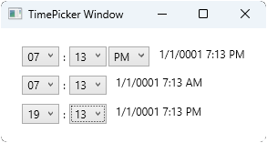

# Time Picker Control for WPF .NET Core v6.0

The Time Picker control is a user interface component that allows users to select a specific time value within a given range. This control is implemented in WPF .NET Core v6.0 and provides a flexible and customizable way to pick time values in your applications.



## Features

- Allows selection of time values with a 12-hour or 24-hour clock format
- Provides support for setting a minimum and maximum time range
- Offers an intuitive and easy-to-use interface for selecting time values
- Displays time values in a customizable format
- Provides a number of customization options to allow developers to tailor the control to their specific needs
- Supports data binding and validation
- Includes an AM/PM toggle for the 12-hour clock format

## Usage

To use the Time Picker control in your application, simply add it to your XAML code:

```xml
<Window x:Class="MyApp.MainWindow"
        xmlns="http://schemas.microsoft.com/winfx/2006/xaml/presentation"
        xmlns:x="http://schemas.microsoft.com/winfx/2006/xaml"
        xmlns:controls="clr-namespace:MyApp.Controls">
    <Grid>
        <controls:TimePicker />
    </Grid>
</Window>
```

By default, the Time Picker control will display time values in a 12-hour clock format. To change this to a 24-hour format, simply set the Is24HourFormat property to true:

```xml
<controls:TimePicker Is24HourFormat="True" />
```

## Properties

The following properties are available on the Time Picker control:

- `SelectedTime`: Gets or sets the currently selected time value. This property is of type `DateTime?`.

- `MinimumTime`: Gets or sets the minimum time value that can be selected. This property is of type `DateTime?`.

- `MaximumTime`: Gets or sets the maximum time value that can be selected. This property is of type `DateTime?`.

- `Is24HourFormat`: Gets or sets a value indicating whether the control should display time values in a 24-hour clock format. This property is of type `bool` and defaults to `false`.

- `TimeFormat`: Gets or sets the format string used to display time values. This property is of type `string` and defaults to "h:mm tt" for 12-hour format and "HH:mm" for 24-hour format.

## Customization

The Time Picker control provides a number of customization options to allow developers to tailor the control to their specific needs. The following properties are available for customization:

- `Background`: Gets or sets the background color of the control.

- `BorderBrush`: Gets or sets the brush used to draw the border of the control.

- `BorderThickness`: Gets or sets the thickness of the control's border.

- `FontFamily`: Gets or sets the font family used to display text in the control.

- `FontSize`: Gets or sets the font size used to display text in the control.

- `Foreground`: Gets or sets the foreground color of the control.

- `Padding`: Gets or sets the padding within the control.

- `Template`: Gets or sets the control's template. This property is of type `ControlTemplate`.

## Data Binding

The Time Picker control supports data binding to allow you to bind the control's properties to your application's data model. The following properties are available for data binding:

- `SelectedTime`: The SelectedTime property can be bound to a `DateTime?` property in your data model.

- `MinimumTime`: The MinimumTime property can be bound to a `DateTime?` property in your data model.

- `MaximumTime`: The MaximumTime propertycan be bound to a `DateTime?` property in your data model.

## Validation

The Time Picker control supports validation to ensure that the selected time value falls within a specified range. You can use the `ValidationRule` class to create custom validation rules for the control.

The following example shows how to create a validation rule that ensures the selected time value is within a specified range:

```csharp
public class TimeRangeValidationRule : ValidationRule
{
    public DateTime? Minimum { get; set; }
    public DateTime? Maximum { get; set; }

    public override ValidationResult Validate(object value, CultureInfo cultureInfo)
    {
        DateTime? time = value as DateTime?;
        if (time == null)
        {
            return new ValidationResult(false, "Invalid time value.");
        }

        if (Minimum != null && time.Value.TimeOfDay < Minimum.Value.TimeOfDay)
        {
            return new ValidationResult(false, "Time value is below the minimum allowed value.");
        }

        if (Maximum != null && time.Value.TimeOfDay > Maximum.Value.TimeOfDay)
        {
            return new ValidationResult(false, "Time value is above the maximum allowed value.");
        }

        return ValidationResult.ValidResult;
    }
}
```

To use this validation rule with the Time Picker control, add an instance of the rule to the control's `ValidationRules` collection:

```xml
<controls:TimePicker>
    <controls:TimePicker.ValidationRules>
        <local:TimeRangeValidationRule Minimum="{Binding MinTime}" Maximum="{Binding MaxTime}" />
    </controls:TimePicker.ValidationRules>
</controls:TimePicker>
```

## Conclusion

The Time Picker control provides a flexible and customizable way to pick time values in your WPF .NET Core v6.0 applications. With its support for data binding, validation, customization, and the added AM/PM toggle for the 12-hour format, you can easily tailor the control to your specific needs.


## Contributing

We welcome contributions from the community. If you're interested in contributing to the ColorPicker Control, please read our [Contributing Guidelines](./CONTRIBUTING.md) for more information.

## License

The ColorPicker Control is licensed under the [MIT License](./LICENSE).


## Credits

TimePicker  was developed by [Jon M. Sales](mailto:jonsales@jonmsales.com) as an open-source project. Special thanks to all contributors and users of the control.

---

Happy coding!